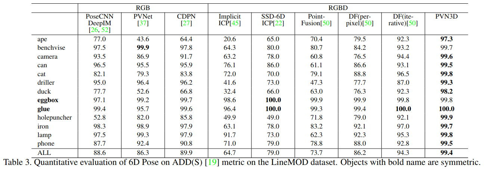
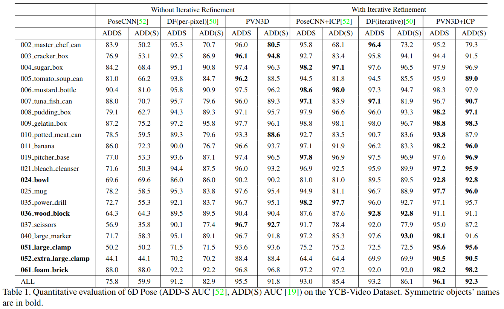
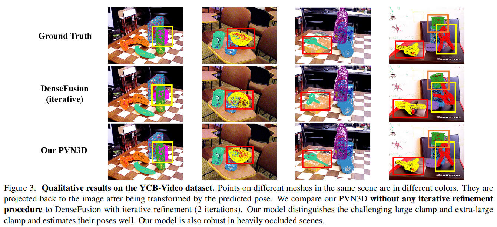
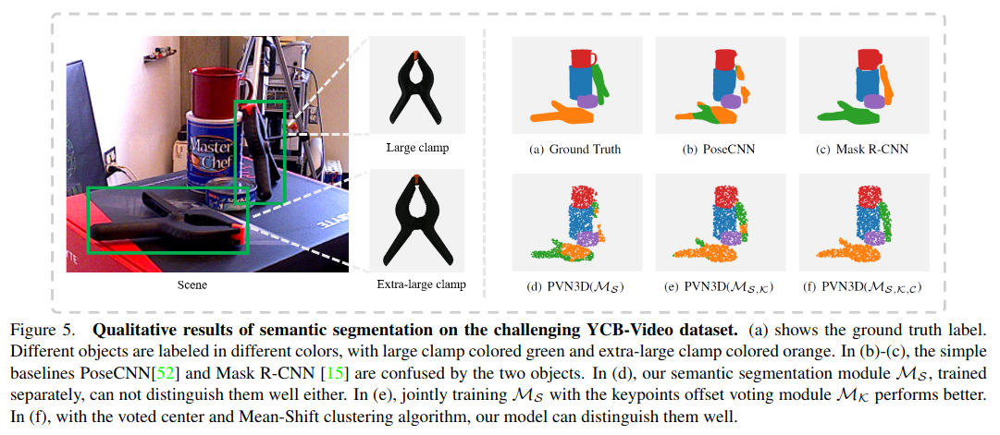

Hajar
# PVN3D
This is the source code for ***PVN3D: A Deep Point-wise 3D Keypoints Voting Network for 6DoF Pose Estimation***, **CVPR 2020**. ([PDF](http://openaccess.thecvf.com/content_CVPR_2020/papers/He_PVN3D_A_Deep_Point-Wise_3D_Keypoints_Voting_Network_for_6DoF_CVPR_2020_paper.pdf), [Video_bilibili](https://www.bilibili.com/video/av89408773/), [Video_youtube](https://www.youtube.com/watch?v=ZKo788cyD-Q&t=1s)).

<div align=center></div>

## Installation
- Install the NVIDIA driver version 440
  ```shell
  sudo apt install nvidia-driver-440
  # reboot
  shutdown -r now
  ```
- Install CUDA10.2 from the [NIVIDA website](https://developer.nvidia.com/cuda-10.2-download-archive).
  Remove other versions as explained in the [NVIDIA installation guide](https://docs.nvidia.com/cuda/archive/10.2/cuda-installation-guide-linux/index.html#handle-uninstallation).
  For Ubuntu 18.04 the instruction for "deb (network)" work well:
  ```shell
  wget https://developer.download.nvidia.com/compute/cuda/repos/ubuntu1804/x86_64/cuda-ubuntu1804.pin
  sudo mv cuda-ubuntu1804.pin /etc/apt/preferences.d/cuda-repository-pin-600
  sudo apt-key adv --fetch-keys https://developer.download.nvidia.com/compute/cuda/repos/ubuntu1804/x86_64/7fa2af80.pub
  sudo add-apt-repository "deb http://developer.download.nvidia.com/compute/cuda/repos/ubuntu1804/x86_64/ /"
  sudo apt-get update
  sudo apt-get -y install cuda-10-2
  ```
- Create and activate a python3 virtual environment.
  Install the requirements.
  ```shell
  python3 -m venv venv
  source venv/bin/activate
  # Cython an numpy must be installed before requirements.txt
  pip3 install Cython numpy --user
  pip3 install -r requirements.txt
  ```
- Install tkinter through ``sudo apt install python3-tk``
- Install python-pcl. For Ubtuntu 18.04 from source:
  ```shell
  # install dependencies
  sudo apt install libpcl-dev libvtk6-dev
  # clone fork with fix for Ubuntu 18.04
  git clone https://github.com/Tuebel/python-pcl
  cd python-pcl
  python3 setup.py install
  ```
- Install PointNet++ (refer from [Pointnet2_PyTorch](https://github.com/erikwijmans/Pointnet2_PyTorch)):
  ```shell
  git clone https://github.com/erikwijmans/Pointnet2_PyTorch
  cd Pointnet2_PyTorch
  pip3 install -r requirements.txt
  cd ..
  python3 setup.py build_ext
  ```

## Datasets
- **LineMOD:** Download the preprocessed LineMOD dataset from [here](https://drive.google.com/drive/folders/19ivHpaKm9dOrr12fzC8IDFczWRPFxho7) (refer from [DenseFusion](https://github.com/j96w/DenseFusion)). Unzip it and link the unzipped ``Linemod_preprocessed/`` to ``pvn3d/datasets/linemod/Linemod_preprocessed``:
  ```shell
  ln -s path_to_unzipped_Linemod_preprocessed pvn3d/datasets/linemod/
  ```
- **YCB-Video:** Download the YCB-Video Dataset from [PoseCNN](https://rse-lab.cs.washington.edu/projects/posecnn/). Unzip it and link the unzipped```YCB_Video_Dataset``` to ```pvn3d/datasets/ycb/YCB_Video_Dataset```:

  ```shell
  ln -s path_to_unzipped_YCB_Video_Dataset pvn3d/datasets/ycb/
  ```


## Training and evaluating

### Training on the LineMOD Dataset
- First, generate synthesis data for each object using scripts from [raster triangle](https://github.com/ethnhe/raster_triangle).
- Train the model for the target object. Take object ape for example:
  ```shell
  cd pvn3d
  python3 -m train.train_linemod_pvn3d --cls ape
  ```
  The trained checkpoints are stored in ``train_log/linemod/checkpoints/{cls}/``, ``train_log/linemod/checkpoints/ape/`` in this example.

### Evaluating on the LineMOD Dataset
- Start evaluation by:
  ```shell
  # commands in eval_linemod.sh
  cls='ape'
  tst_mdl=train_log/linemod/checkpoints/${cls}/${cls}_pvn3d_best.pth.tar
  python3 -m train.train_linemod_pvn3d -checkpoint $tst_mdl -eval_net --test --cls $cls
  ```
  You can evaluate different checkpoint by revising ``tst_mdl`` to the path of your target model.
- We provide our pre-trained models for each object at [onedrive link](https://hkustconnect-my.sharepoint.com/:f:/g/personal/yhebk_connect_ust_hk/Ehay5pPtl-BGnvAEclXBRu8BEpZeHuG9x-aN_djAtt5rPA?e=3BvfrV), [baiduyun link](https://pan.baidu.com/s/1MhqPvjROCkR17W1tiXE9SA) (access code(提取码): 8kmp). Download them and move them to their according folders. For example, move the ``ape_pvn3d_best.pth.tar`` to ``train_log/linemod/checkpoints/ape/``. Then revise ``tst_mdl=train_log/linemod/checkpoints/ape/ape_pvn3d_best.path.tar`` for testing.

### Demo/visualizaion on the LineMOD Dataset
- After training your models or downloading the pre-trained models, you can start the demo by:
  ```shell
  # commands in demo_linemod.sh
  cls='ape'
  tst_mdl=train_log/linemod/checkpoints/${cls}/${cls}_pvn3d_best.pth.tar
  python3 -m demo -dataset linemod -checkpoint $tst_mdl -cls $cls
  ```
  The visualization results will be stored in ``train_log/linemod/eval_results/{cls}/pose_vis``

### Training on the YCB-Video Dataset
- Preprocess the validation set to speed up training:
  ```shell
  cd pvn3d
  python3 -m datasets.ycb.preprocess_testset
  ```
- Start training on the YCB-Video Dataset by:
  ```shell
  python3 -m train.train_ycb_pvn3d
  ```
  The trained model checkpoints are stored in ``train_log/ycb/checkpoints/``

### Evaluating on the YCB-Video Dataset
- Start evaluating by:
  ```shell
  # commands in eval_ycb.sh
  tst_mdl=train_log/ycb/checkpoints/pvn3d_best.pth.tar
  python3 -m train.train_ycb_pvn3d -checkpoint $tst_mdl -eval_net --test
  ```
  You can evaluate different checkpoint by revising the ``tst_mdl`` to the path of your target model.
- We provide our pre-trained models at [onedrive link](https://hkustconnect-my.sharepoint.com/:f:/g/personal/yhebk_connect_ust_hk/EmQQXKJdC1FDplKS4FQ6n78B4T7eyvhSEsZ8dZySJUmv4w?e=7BwsS5), [baiduyun link](https://pan.baidu.com/s/1hCzqfB3JhOzF3LATsWFFBg) (access code(提取码): h2i5). Download the ycb pre-trained model, move it to ``train_log/ycb/checkpoints/`` and modify ``tst_mdl`` for testing.

### Demo/visualizaion on the LineMOD Dataset
- After training your model or downloading the pre-trained model, you can start the demo by:
  ```shell
  # commands in demo_ycb.sh
  tst_mdl=train_log/ycb/checkpoints/pvn3d_best.pth.tar
  python3 -m demo -checkpoint $tst_mdl -dataset ycb
  ```
  The visualization results will be stored in ``train_log/ycb/eval_results/pose_vis``

## Results
- Evaluation result on the LineMOD dataset:
  
- Evaluation result on the YCB-Video dataset:
  
- Visualization of some predicted poses on YCB-Video dataset:
  
- Joint training for distinguishing objects with similar appearance but different in size:
  

## Citations
Please cite [PVN3D](https://arxiv.org/abs/1911.04231) if you use this repository in your publications:
```
@InProceedings{He_2020_CVPR,
author = {He, Yisheng and Sun, Wei and Huang, Haibin and Liu, Jianran and Fan, Haoqiang and Sun, Jian},
title = {PVN3D: A Deep Point-Wise 3D Keypoints Voting Network for 6DoF Pose Estimation},
booktitle = {IEEE/CVF Conference on Computer Vision and Pattern Recognition (CVPR)},
month = {June},
year = {2020}
}
```
